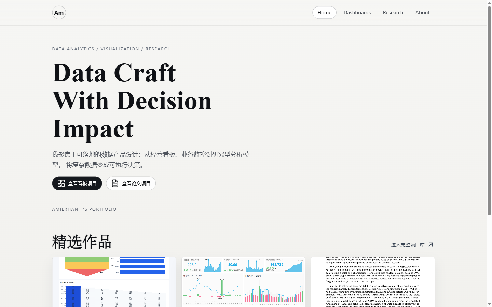

# AmierHan 数据分析作品集网站

一个用于展示个人数据分析能力的静态作品集网站，面向 HR / 面试官快速浏览。

## 项目内容

网站当前包含 4 个页面：

- `index.html`：首页（品牌展示 + 精选作品）
- `dashboards.html`：看板项目页（图片与 PDF 在线预览）
- `papers.html`：论文项目页（PDF 在线预览与下载）
- `about.html`：个人能力与工具栈介绍

风格关键词：高级感、简洁、数据作品导向、统一视觉语言。

## 目录结构

```text
个人作品集网站搭建/
├─ index.html
├─ dashboards.html
├─ papers.html
├─ about.html
├─ styles.css
├─ script.js
├─ 作品/                      # 原始看板图片与论文 PDF
├─ assets/
│  ├─ previews/              # 从 PDF 首页面生成的预览图
│  └─ readme/
│     └─ home-page-snapshot.png   # Home 页快照
└─ AmierHan-portfolio-site.zip
```

## 本地预览

在项目目录执行：

```powershell
python -m http.server 4173
```

然后在浏览器打开：

- `http://127.0.0.1:4173/index.html`

## 作品维护说明

1. 新增看板图片：放入 `作品/`，并在 `dashboards.html` 增加对应项目卡片。
2. 新增论文 PDF：放入 `作品/`，并在 `papers.html` 增加卡片。
3. 若需要论文封面预览图，可用 Python + PyMuPDF 从 PDF 首页导出到 `assets/previews/`。
